# COM-LAB-I-LabSheet-Week-15
##  C# Unit test and github CI/CD

18.ส่ง project ขึ้นบน  github

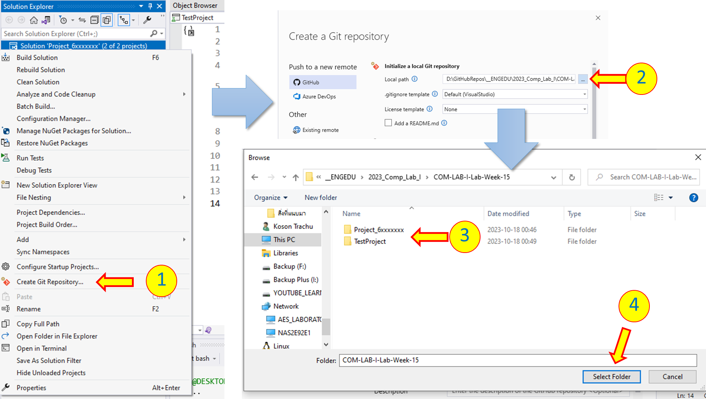

1. คลิกขวาที่ชื่อ  Solution 'Project_6...... (2 of 2 Projects)' เลือก Create Git repository...
2. เลือก Local Path
3. ดูให้แน่ใจว่า Local path ที่เลือก มี folder ของ project ทั้งสองปรากฏอยู่
4. กด Select folder

19.Push และตามไปตรวจสอบบน github server 

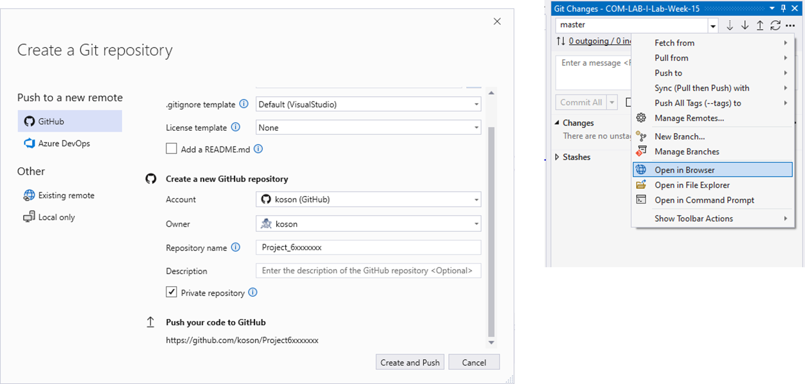

- เพื่อความสะดวก สามารถคลิก ... แล้วเลือก Open in Browser ได้

20.บน github server จะต้องเห็น folder ของโปรเจคทั้งสองอยู่ข้างกัน

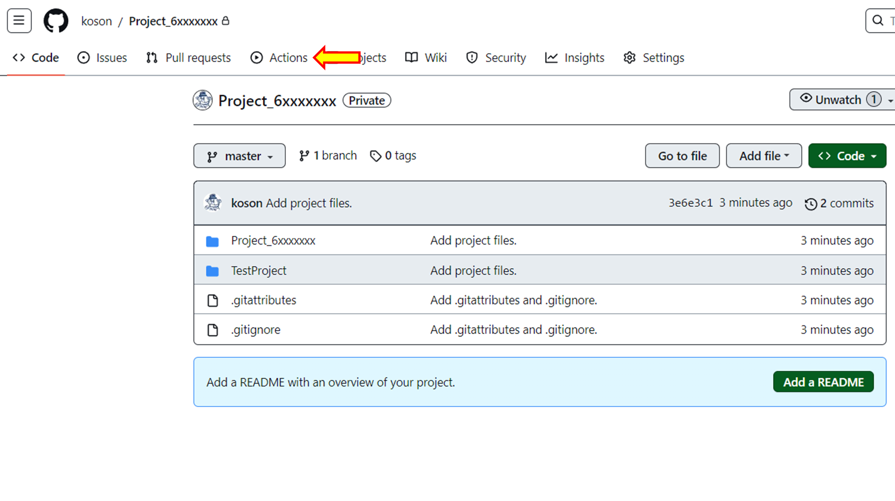

- กดปุ่ม  Actions

21.เลือก .NET Desktop กด Configure

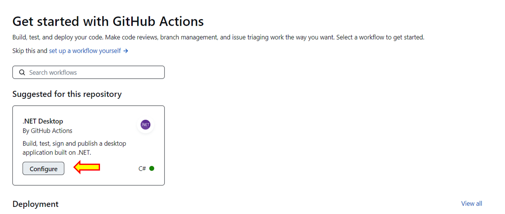

22.จะได้หน้าจอแบบนี้

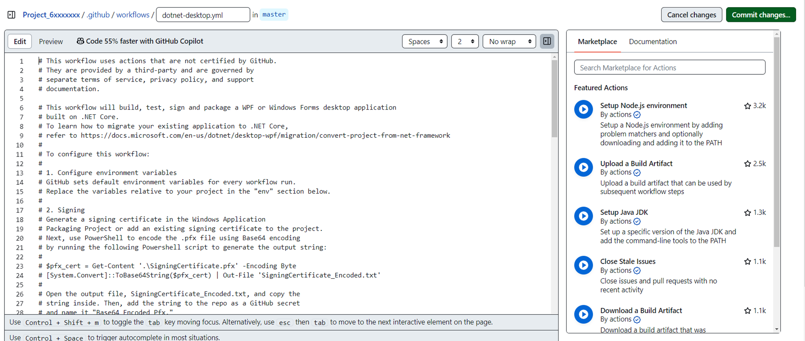

23.แก้ไข code ในไฟล์ dotnet-desktop.yml ให่้เป็นดังนี้

```yml
# This workflow uses actions that are not certified by GitHub.
# They are provided by a third-party and are governed by
# separate terms of service, privacy policy, and support
# documentation.

# This workflow will build, test, sign and package a WPF or Windows Forms desktop application
# built on .NET Core.
# To learn how to migrate your existing application to .NET Core,
# refer to https://docs.microsoft.com/en-us/dotnet/desktop-wpf/migration/convert-project-from-net-framework
#
# To configure this workflow:
#
# 1. Configure environment variables
# GitHub sets default environment variables for every workflow run.
# Replace the variables relative to your project in the "env" section below.
#
# 2. Signing
# Generate a signing certificate in the Windows Application
# Packaging Project or add an existing signing certificate to the project.
# Next, use PowerShell to encode the .pfx file using Base64 encoding
# by running the following Powershell script to generate the output string:
#
# $pfx_cert = Get-Content '.\SigningCertificate.pfx' -Encoding Byte
# [System.Convert]::ToBase64String($pfx_cert) | Out-File 'SigningCertificate_Encoded.txt'
#
# Open the output file, SigningCertificate_Encoded.txt, and copy the
# string inside. Then, add the string to the repo as a GitHub secret
# and name it "Base64_Encoded_Pfx."
# For more information on how to configure your signing certificate for
# this workflow, refer to https://github.com/microsoft/github-actions-for-desktop-apps#signing
#
# Finally, add the signing certificate password to the repo as a secret and name it "Pfx_Key".
# See "Build the Windows Application Packaging project" below to see how the secret is used.
#
# For more information on GitHub Actions, refer to https://github.com/features/actions
# For a complete CI/CD sample to get started with GitHub Action workflows for Desktop Applications,
# refer to https://github.com/microsoft/github-actions-for-desktop-apps

name: .NET Core Desktop

on:
  push:
    branches: [ "master" ]
  pull_request:
    branches: [ "master" ]

jobs:

 run-selected-unittests:
    runs-on: windows-latest
    env:
      ACTIONS_ALLOW_UNSECURE_COMMANDS: true
    name: Run MSBuild and VSTest
    
    steps:
      - name: Checkout code
        uses: actions/checkout@v2.1.0
        id: checkout_code
            
      - name: Setup MSBuild and add to PATH
        uses: microsoft/setup-msbuild@v1.0.0
        id: setup_msbuild
              
      - name: Run MSBuild
        id: run_msbuild
        run: |
          msbuild .\Project_6xxxxxxx\Project_6xxxxxxx.sln  /t:clean /p:Configuration=Debug
          nuget restore .\Project_6xxxxxxx\Project_6xxxxxxx.sln
          msbuild .\Project_6xxxxxxx\Project_6xxxxxxx.sln  /t:build /p:Configuration=Debug
     
      - name: Setup VSTest and add to PATH
        uses: darenm/Setup-VSTest@v1
        id: setup_vstest

      - name: Test Project Members
        id: run_vstest
        working-directory: .\TestProject\\bin\Debug\net6.0
        run: vstest.console.exe TestProject.dll /Tests:TestProjectMembersCount
```

24.commit สิ่งที่ได้แก้ไข ใน repository จะมี folder เพิ่มขึ้นมาเพื่อเป็นที่เก็บไฟล์ yml ที่ทำหน้าที่ CI/CD 

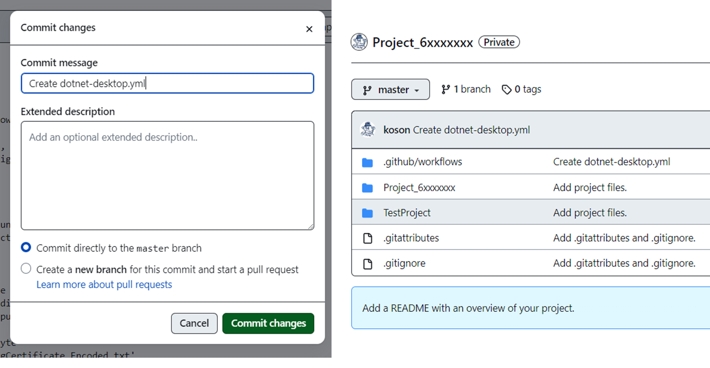

25.กดปุ่ม  Actions ในหน้า repository

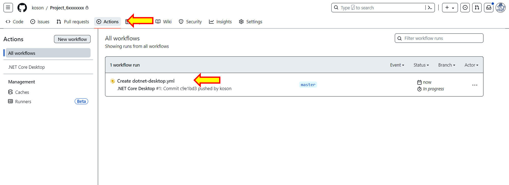

- คลิกที่ Create dotnet-desktop.yml เพื่อดูความคืบหน้าในการทดสอบ

26.กระบวนการ CI/CD จะเริ่มทำงานตาม script ในไฟล์ yml ที่เราแก้ไขไป

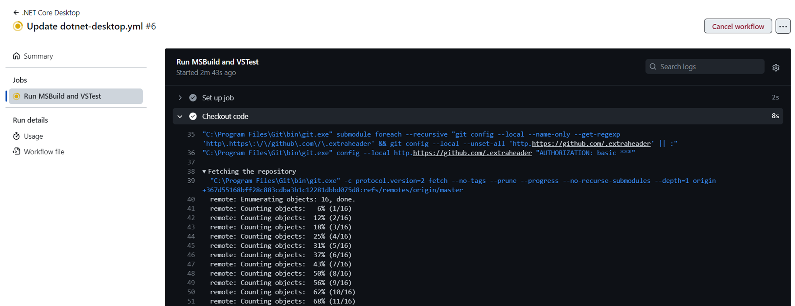

27.กระบวนการทดสอบ ควรจะมี error เช่นเดียวกับใน Visual studio

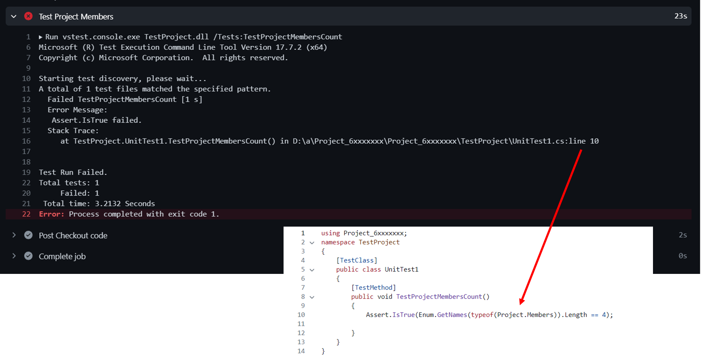

28.กลับไปที่่ Visual studio


- แก้ไข code ในไฟล์ Project.cs โดยการเพิ่มสมาชิกไปอีก 1 คน
- ทดสอบ โดยเรียกเมนู Test -> Run All Tests
- ควรจะได้ผลการทดสอบเป็นผ่าน ดังรูปด้านบน

29.ไปที่ git bash ใน Terminal view

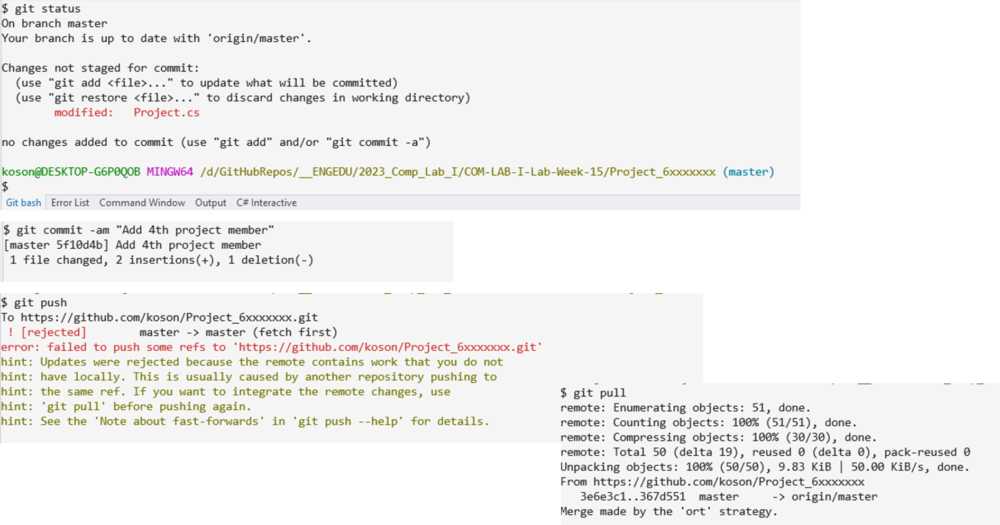

- git status

- git commit

- git push ซึ่งควรจะมี error เนื่องจากมีการ update ที่บน github server ดังนั้นต้องทำคำสั่ง git pull

- git pull

30.เมื่อ push ขึ้นบน server กระบวนการตรวจสอบอัตโนมัติจะเริ่มทำงาน

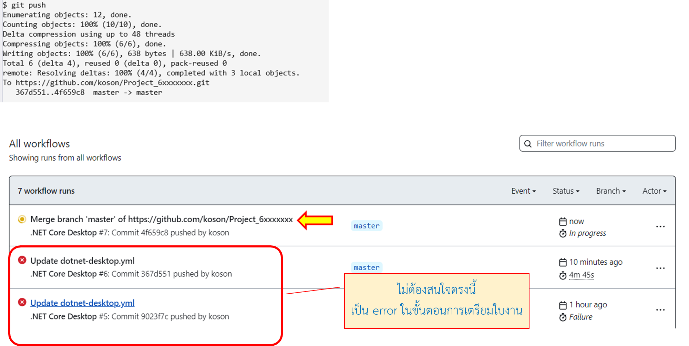

- ตรวจสอบได้จากการกดปุ่ม Actions

### [>> ยังไม่จบ มีต่ออีกนิด >>](./Labsheet-2.md)
