# COM-LAB-I-LabSheet-Week-15
##  C# Unit test and github CI/CD

การทดลองนี้จะมีสองส่วนย่อยคือ 

1. การทำ unit test บน Visual studio

2. การทำ automation test บน Guthub (CI/CD)

##  ลำดับขั้นการทดลอง

1. สร้าง project ใหม่เป็น console project


คลิก Next

2. ตั้งชือ Project_<รหัสนักศึกษา>

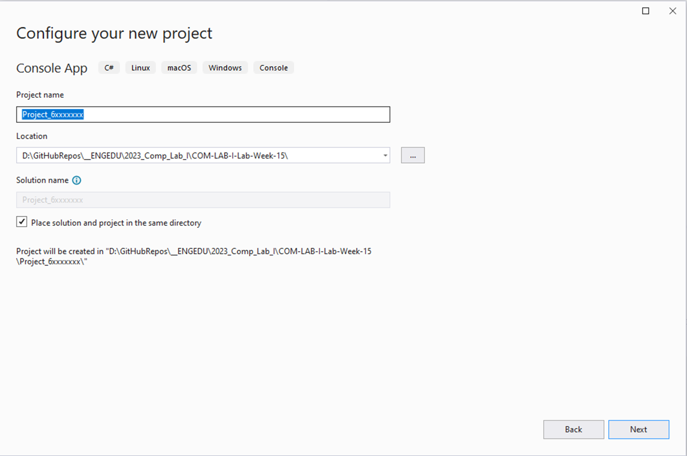


- ในช่อง Location ให้เลือก folder ที่ยังไม่มีไฟล์ใดๆ (ถ้าให้ดีก็สร้าง folder ใหม่สำหรับงานนี้)

- คลิก Next

3. เลือก framework

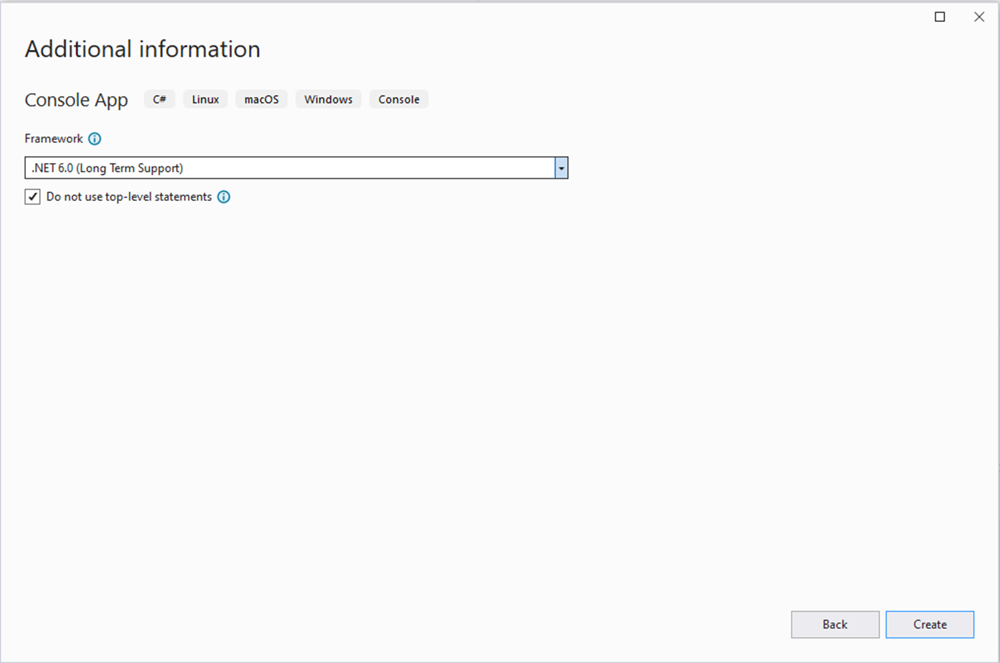

- คลิก Create

4. เพิ่ม class ใน project เพื่อทำงานกับรายชื่อสมาชิก project

- เลือกเมนู Project -> Add Class…

- ตั้งชื่อไฟล์เป็น Project.cs


5. แก้ไข code ในไฟล์  Project.cs ตามรูปนี้

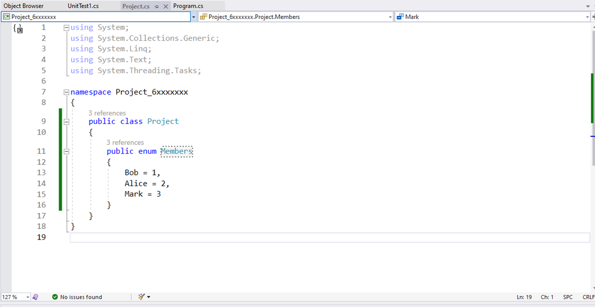

- เปลี่ยน Bob, Alice, Mark เป็นชื่อเพื่อนในกลุ่ม ห้ามมีช่องว่างในชื่อ

6. แก้ไข code ใน program.cs เพื่อให้แสดงรายชื่อสมาชิกในกลุ่ม

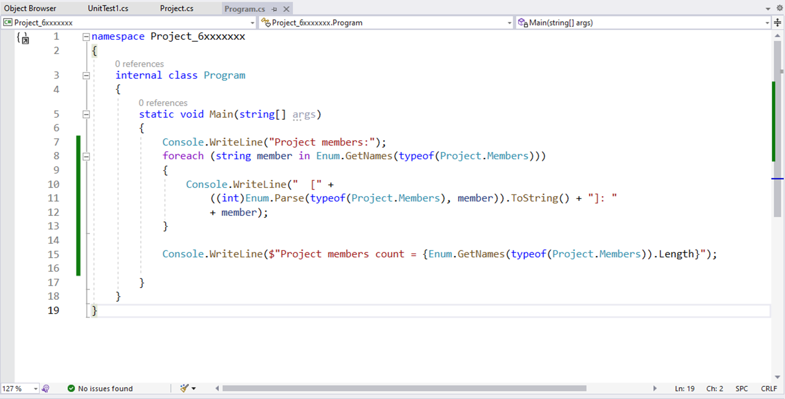

code ที่ใช้ในข้อ 6

```cs
namespace Project_6xxxxxxx
{
    internal class Program
    {
        static void Main(string[] args)
        {
            Console.WriteLine("Project members:");
            foreach (string member in Enum.GetNames(typeof(Project.Members)))
            {
                Console.WriteLine("  [" + 
                    ((int)Enum.Parse(typeof(Project.Members), member)).ToString() + "]: "
                    + member);
            }

            Console.WriteLine($"Project members count = {Enum.GetNames(typeof(Project.Members)).Length}");

        }
    }
}
```
7. ถ้าโปรแกรมถูกต้อง เมื่อรันจะได้หน้าจอประมาณนี้

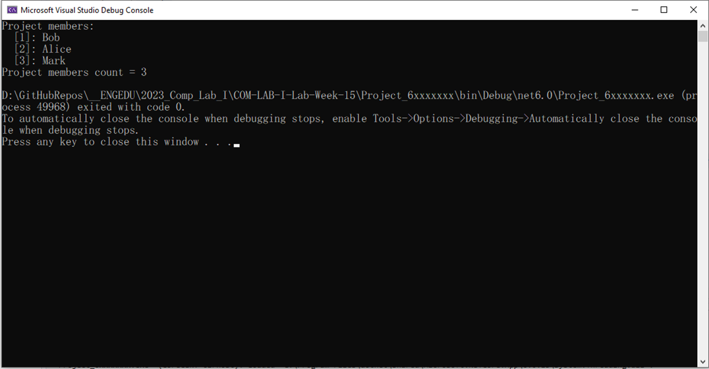

- ชื่อที่แสดงต้องเป็นชื่อสมาชิกในกลุ่ม 

- capture มาให้ดูด้วยนะจ๊ะ

8. เพิ่ม project ใหม่สำหรับ Test Unit

- คลิกขวาที่ Solution เลือก Add new project

- ในช่อง search ด้านบน ใส่คำว่า  `test`

- เลือก  MSTest Test Project ในภาษา C# (ดู Icon ให้ดี)


9. ตั้งชื่อและเลือกที่ตั้ง

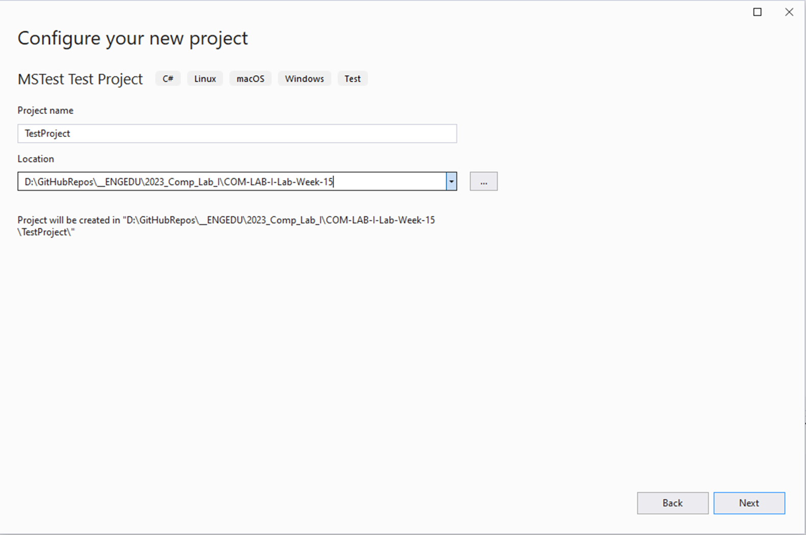

- Location ใช้ที่เดียวกับในข้อ 2 (จะได้ folder ของโปรเจคอยู่ข้าง ๆ กัน อย่าให้ไปอยู่ซ้อนกัน)

- คลิก Next


10. เลือก framework 

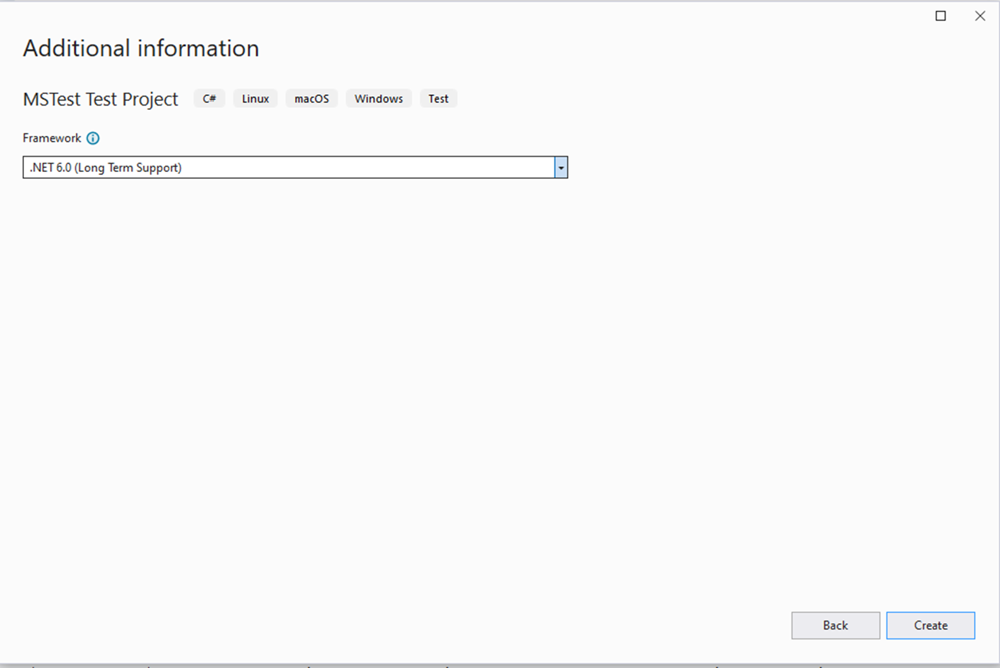

- คลิก Create

11. จะได้ project ใหม่

- คลิกเมนู Test ->  Run All Tests

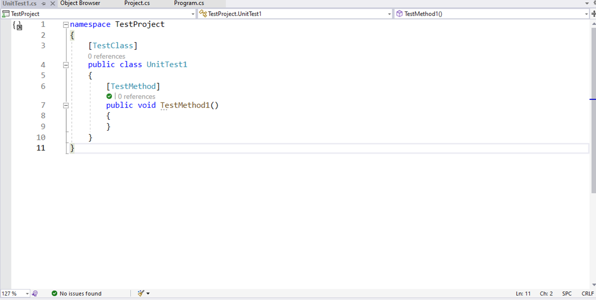

- เมื่อรันการทดสอบเสร็จ จะมีเครื่องหมายถูกสีเขียวปรากฏที่หน้าชื่อ  method


12. Visual studio จะแสดงผลการ Test เป็นหน้าต่าง

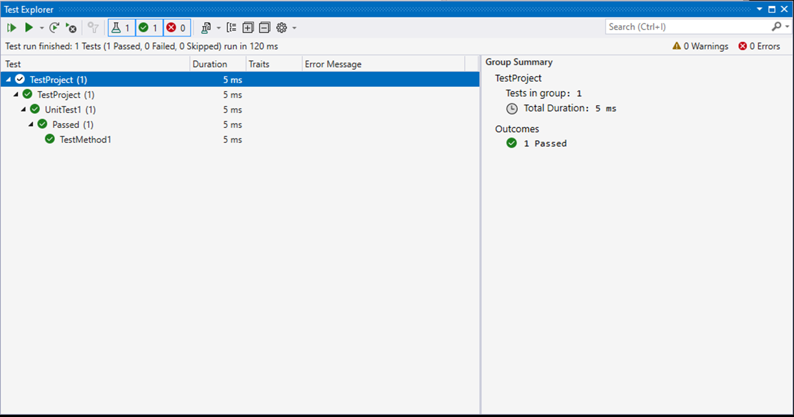

13. เพิ่ม project ที่จะทดสอบให้แก่ test project

- เลือกโปรเจค TestProject
- เลือกเมนู Project -> Add Project Reference...

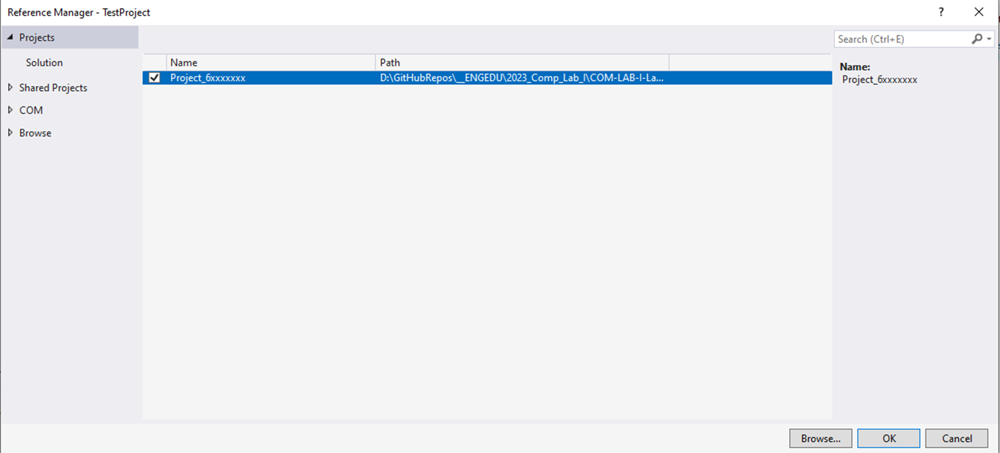

- ติ๊กถูกที่ชื่อโปรเจคที่จะทดสอบ 
- คลิก OK

14. เพิ่ม code สำหรับทดสอบ ในที่นี้จะทดสอบจำนวนสมาชิก ว่าเท่ากับจำนวนที่กำหนดหรือไม่

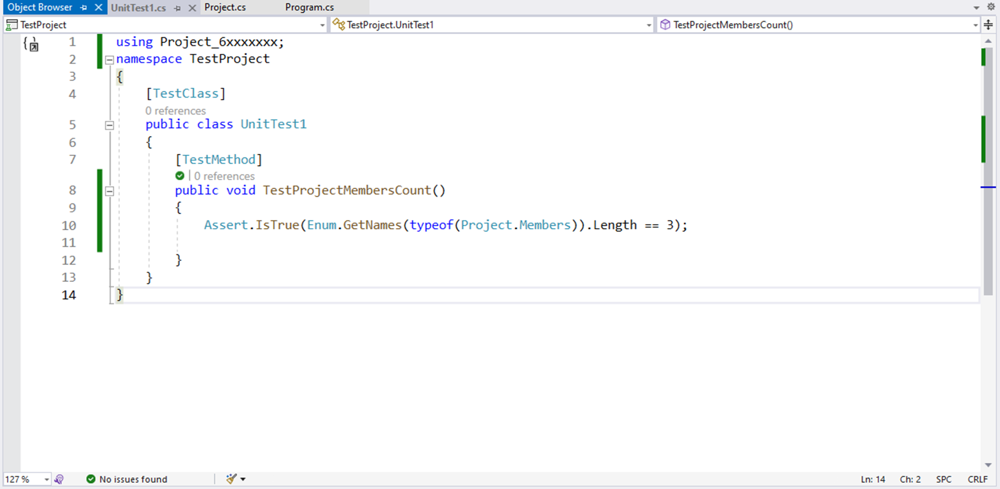

- คลิกเมนู Test ->  Run All Tests

15. ผลการ Test ควรจะผ่าน เพราะตอนนี่มีจำนวนสมาชิก 3 คน

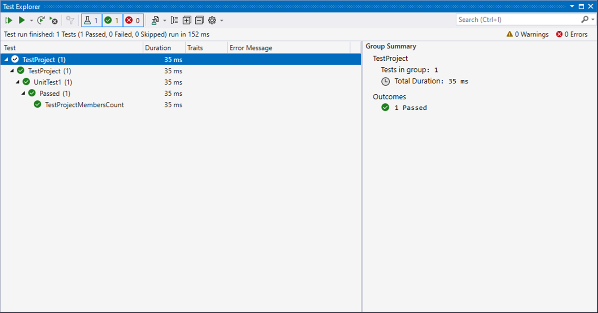


16. ทดลองแก้จำนวนสมาชิกเป็น 4 คน

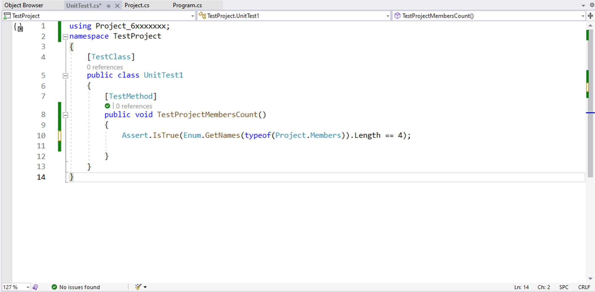

- คลิกเมนู Test ->  Run All Tests

17. ผลที่ได้ควรจะ Failed เพราะจำนวนสมาชิกในคลาสมี 3 แต่จำนวนที่ทดสอบมี 4

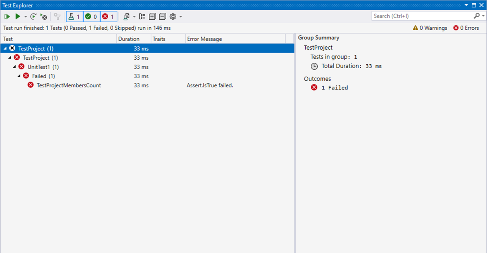


ยังไม่ต้องแก้ไขใด ๆ เพราะเราจะไปทดสอบบน github ว่าสามารถพบที่ผิดนี้หรือไม่

### [>> ต่อไป ส่งขึ้น github >>](./Labsheet-1.md)


